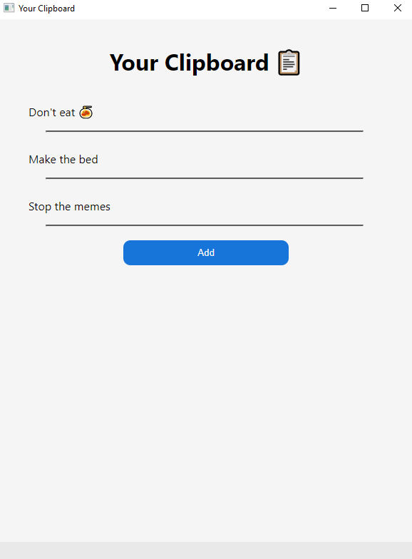
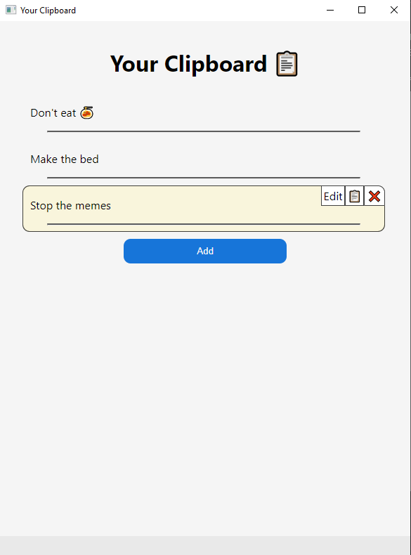
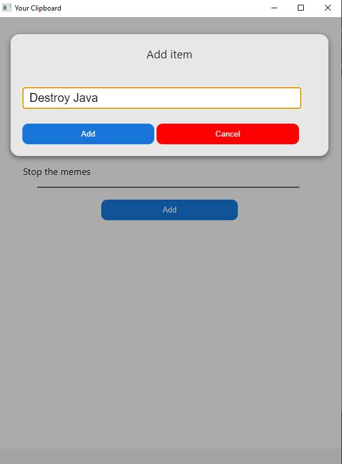
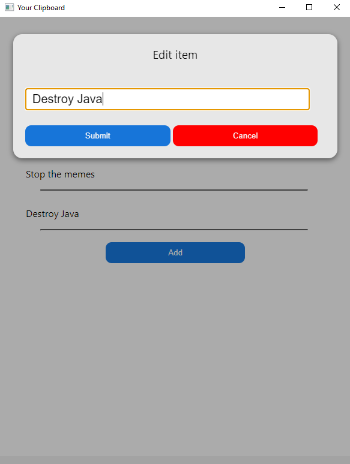

# Your Clipboard 📋

An electron app that has multiple fields for pasting in stuff and a line next to it to copy contents to clipboard. 

Download now [here](https://github.com/Zeyu-Li/your-clipboard/releases/tag/1.0.0) (installer or build)

You can copy the text, edit it, or remove it

Add a new item

Or edit an existing item

## License

MIT